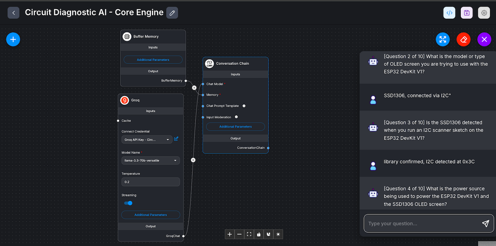
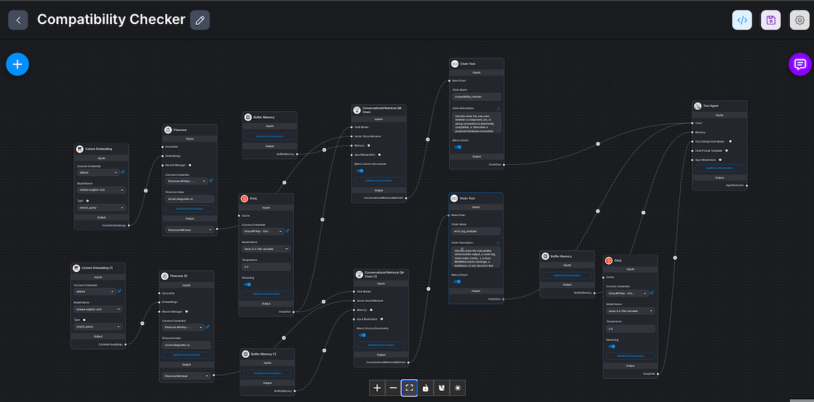

# Circuit Diagnostic AI — "The AI Lab Mentor"

An AI-driven engineering reasoning platform built with **Flowise** and **Retrieval-Augmented Generation (RAG)**. It guides engineers through adaptive, documentation-grounded diagnostic workflows for embedded systems (ESP32) hardware faults.

Unlike standard one-shot AI chatbots, this platform enforces systematic hardware debugging through state-machine tracking, persistent project memory, and automated professional report generation.

---

## 🚀 The Core Engineering Value
As an Electronic and Communication Engineering (ECE) student, I built this to solve a widespread industry and lab problem: **Unstructured trial-and-error hardware debugging**. This project applies software/AI orchestration principles to electronic diagnostic methodologies:
- **State-Driven Guardrails:** Forces the LLM to follow a strict `Observe → Ask → Measure → Eliminate → Conclude → Explain → Document` workflow.
- **Deterministic Token Management:** Maintains state inside an explicit JSON schema within memory buffer loops to prevent evidence reversal or duplication across multi-turn diagnostic sessions.
- **Data Grounding over Hallucination:** Leverages RAG (Pinecone + Cohere Embeddings) to ensure assertions (such as I2C pull-up necessities or brownout thresholds) are pulled from official datasheets rather than general model weights.

---

## 🛠️ Architecture & Tech Stack

- **Orchestration Layer:** Flowise Cloud (No-code/Low-code AI agents)
- **Core LLM Processing:** ChatGroq (`llama-3.3-70b-versatile`)
- **Retrieval-Augmented Generation (RAG):** Pinecone (Serverless) vector database, Cohere Embeddings (`embed-english-v3.0`)
- **Context Grounding:** Official Espressif ESP32 Datasheets, SSD1306 Display driver specs, DHT22 specifications, AMS1117 LDO datasheet, and a custom-curated Common Failure Library.

### Core Engine — Diagnostic State Machine



The Core Engine chatflow (`Groq` → `Buffer Memory` → `Conversation Chain`) drives the guided diagnostic loop. The mandatory `[Question N of 10]` counter visible in the session panel is a structural fix for a real failure mode: early prompt-only attempts to cap the model at 8–10 questions were followed loosely, since LLMs can't reliably self-count turns from an unstructured transcript.

### Compatibility Checker — Multi-Mode Retrieval Chain



> **Note:** this canvas includes the `Tool Agent` + `Chain Tool` nodes from an earlier architecture, which hit a confirmed Flowise platform bug (`chain.run is not a function`, [GitHub Discussion #3156](https://github.com)) when paired with `Conversational Retrieval QA Chain`. That combination was abandoned in favor of a single merged chain with internal mode detection — see [Phase 4 log](./build-logs/PHASE4_LOG.md) Part 3 for the full root-cause writeup.

---

## 📈 Iterative Engineering & Validation Phases

This project was built following rigorous software engineering test-and-document iterations. Every phase was benchmarked against concrete failure scenarios:

### [Phase 1: Core Diagnostic Engine](./build-logs/PHASE1_LOG.md)
- **Objective:** Establish the guided diagnostic state machine purely using system prompt constraints.
- **Key Discovery:** Identified that raw conversation history buffers fail to sustain evidence integrity over extended conversation turns (8+ interactions), leading the model to reverse valid diagnostic breakthroughs.

### [Phase 2: Structured Project Memory](./build-logs/PHASE2_LOG.md)
- **Objective:** Inject a fenced JSON state object tracking `hypotheses[]`, `eliminated_causes[]`, and `confirmed_facts[]`.
- **Key Discovery:** Mitigated re-asking errors and hallucination loops. Validated that memory alone can narrow down a fault to a category (e.g., I2C communication fault), but RAG is strictly required to identify documented root causes (missing physical pull-ups).

### [Phase 3: Datasheet-Aware RAG](./build-logs/PHASE3_LOG.md)
- **Objective:** Connect Vector Databases with specialized component documentation.
- **Key Discovery:** Configured Cohere + Pinecone chunking strategies to map specific error profiles directly to hardware solutions.

### [Phase 4: Specialized Feature Modules](./build-logs/PHASE4_LOG.md)
- **Objective:** Validate specialized operational modes: Compatibility Checker, Error Log Analyzer (e.g., Guru Meditation handling), and Diagnostic Report Generator.
- **Key Discovery:** Successfully closed the flagship "T7 blank OLED scenario" by achieving accurate, cited diagnostics pointing directly to physical resistor values. Also surfaced and routed around a genuine Flowise platform bug (Chain Tool + Conversational Retrieval QA Chain incompatibility) via architectural consolidation rather than prompt patching.

### [Phase 5: Supporting Features (Engineering Reasoning, Confidence Score, Learning Resources)](./build-logs/PHASE5_LOG.md)
- **Objective:** Require mechanism-level reasoning behind every cause/fix, surface a live ranked confidence display, and validate the existing Learning Resources report section.
- **Key Discovery:** Proxy-tested (Claude Sonnet standing in for Llama-3.3-70B) all three features and caught real bugs — a sourcing/reasoning rule conflict, fabricated confidence on eliminated hypotheses, and unhedged invented datasheet section numbers — before spending any Groq quota. Real Flowise/Llama confirmation pass is in progress.

---

## 💡 Prompt Engineering Highlight: The Diagnostic State Machine
Rather than letting the LLM wander, the system prompts use rigorous structural constraints, such as strict negative rules ("Never list multiple questions," "Never conclude a root cause before asking at least 3 diagnostic questions").

Example architecture from my production prompt structure:
```markdown
1. Ask exactly ONE question per turn.
2. Never conclude a root cause before asking at least 3 diagnostic questions.
3. Power supply stability must be checked before physical component degradation is suspected.
```

A recurring lesson across every phase: **few-shot WRONG/RIGHT examples reliably outperform prose instructions** for behavioral constraints on this stack — this pattern fixed question-bundling, evidence-reversal, hypothesis-display mutual exclusivity, and citation-honesty bugs across five phases of iteration.
